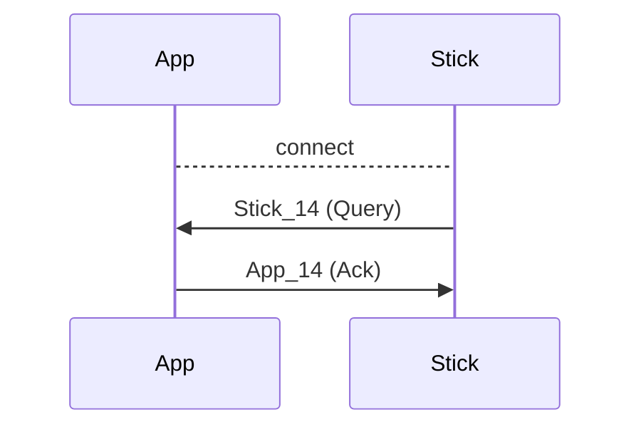

### 公共参数

|参数名称|数据类型|说明|
|--------|--------|--------|
|method|string|Protocol's method|
|token|string|签名校验|
|app_key|string|app应用代码|

```mermaid
sequenceDiagram
App-->Stick: connect
Stick->>App: Stick_14 (Query)
App->>Stick: App_14 (Ack)
```
